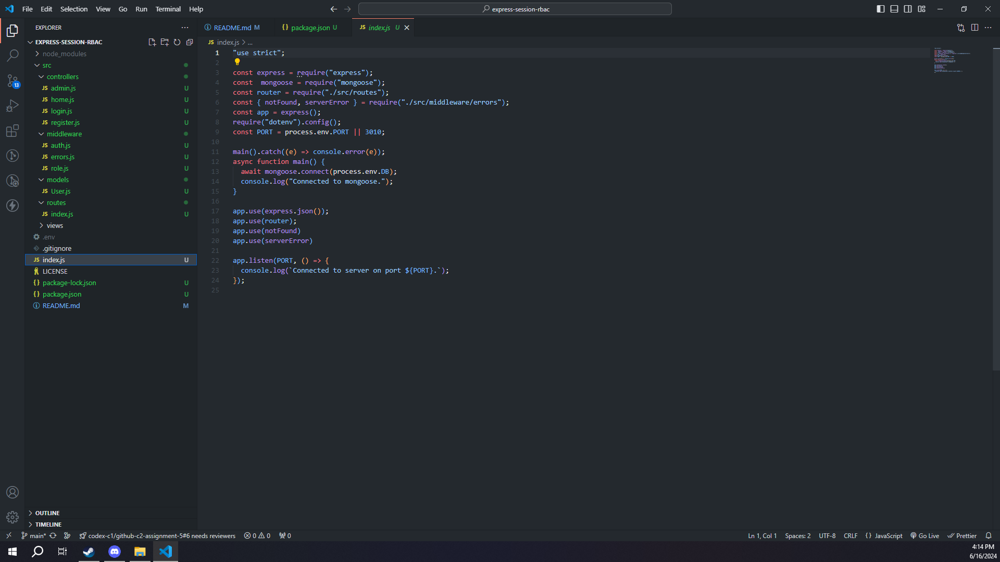
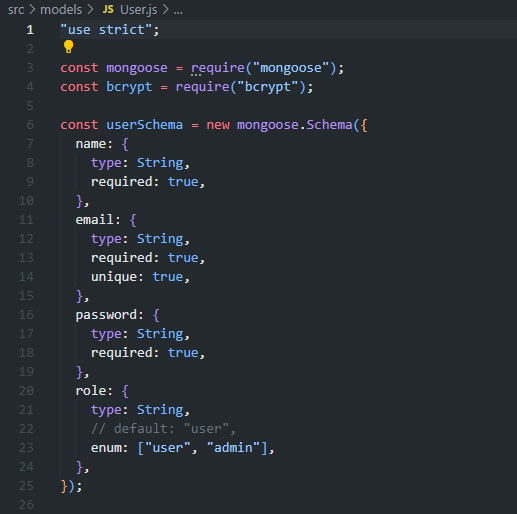
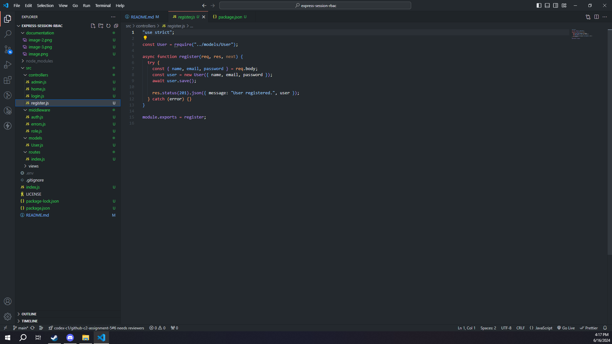
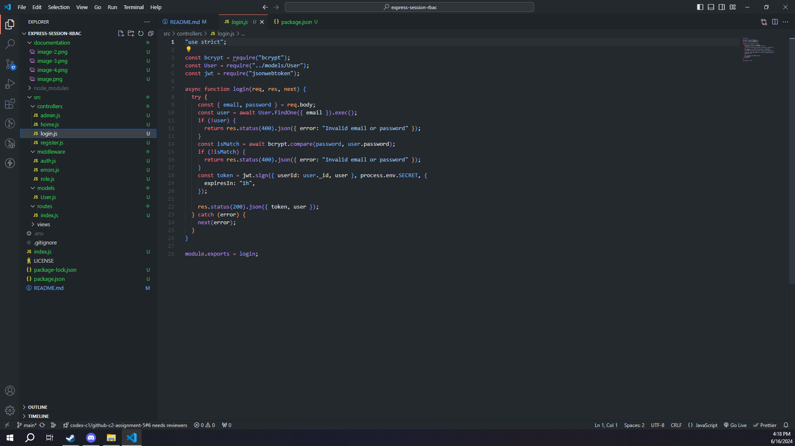
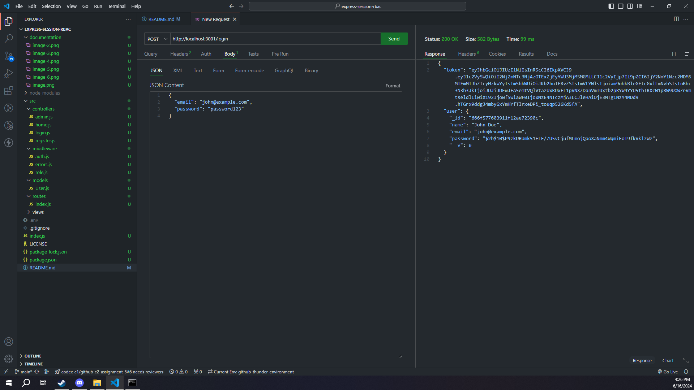
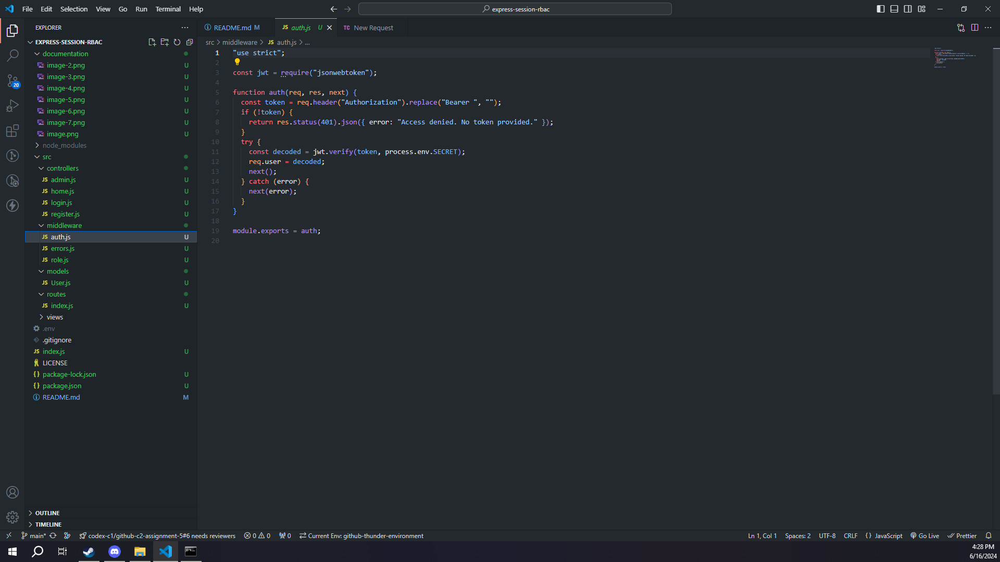
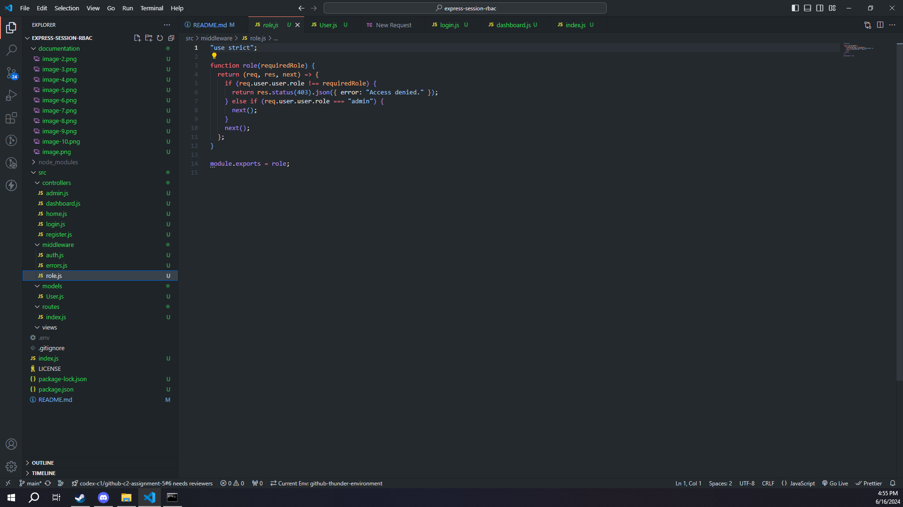
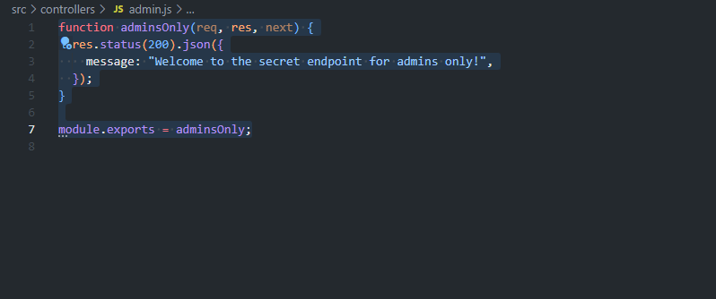
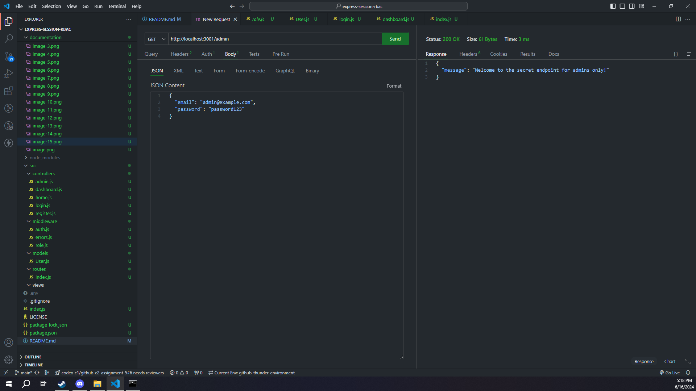
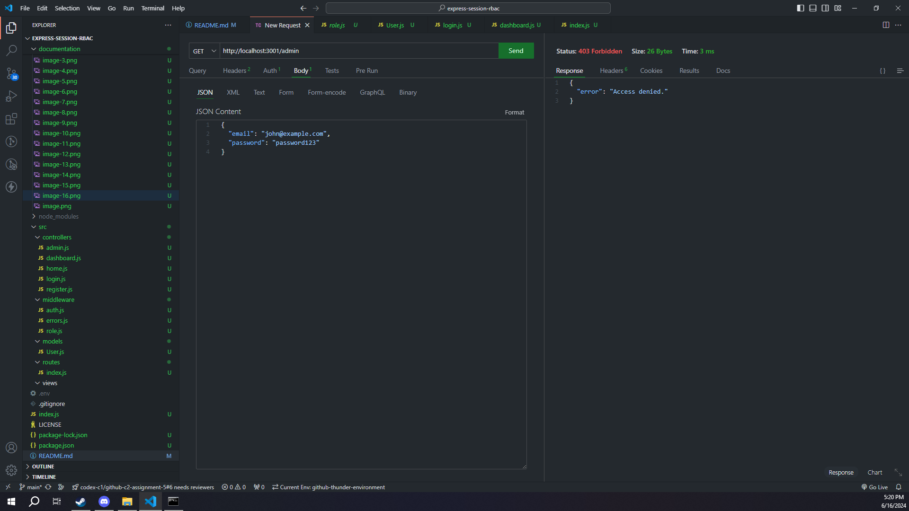

# Objective
Set up a new Express project.
Implement middleware to protect routes.
Understand role-based access control and its importance.
Implement registration and login functionality with role-based access control (RBAC).

# Instructions
## Part 1: Set Up a New Project
### Initialize the Project and Install Dependencies:

mkdir express-session-rbac
cd express-session-rbac
npm init -y
npm install express mongoose bcryptjs jsonwebtoken

### Create the Server:

Create a file named index.js and set up a basic Express server with Mongoose connection.

## Part 2: Define the User Schema with Role and Password Hashing
### Create models/User.js:

Define a user schema with the following fields: name, email, password, and role.  
  

Implement password hashing using bcrypt before saving the user.  
  

## Part 3: Implement Registration and Login Endpoints
## Update index.js to include registration and login routes:

Route to register a new user with hashed passwords (POST /register).  
  

Route to login a user and return a JWT token (POST /login).  
  
  

## Part 4: Test Registration and Login Endpoints
### Start Your Server:

npm run dev

### Test with Thunder Client or Postman:

Register a User:

Method: POST
URL: http://localhost:3000/register
Body: JSON
{
  "name": "John Doe",
  "email": "john@example.com",
  "password": "password123"
}

Login a User:

Method: POST
URL: http://localhost:3000/login
Body: JSON
{
  "email": "john@example.com",
  "password": "password123"
}
If successful, this should return a JWT token.

### Take Screenshots:

Screenshot of the POST request to register a user.  
  !

Screenshot of the POST request to login a user with the returned JWT token.  
  

## Part 5: Implement Middleware for Route Protection
### Create Middleware for Authentication:

Create a file named middleware/auth.js and implement middleware to check if a user is authenticated by verifying the JWT token.  
  

## Part 6: Protect Routes with Authentication Middleware
### Update index.js to include protected routes:

Route to access a protected resource (GET /dashboard).  
  
  

## Part 7: Test Protected Routes
### Start Your Server:

npm run dev

### Test with Thunder Client or Postman:

Access Protected Route:

Method: GET
URL: http://localhost:3000/dashboard
Header:
Authorization: Bearer <your_jwt_token>
If the token is valid, you should see "This is the dashboard." If not, you should receive an error message.

### Take Screenshot:

Screenshot of the GET request to access the protected route.  
  

## Part 8: Implement Role-Based Access Control (RBAC)
### Create Middleware for Role-Based Access Control:

Create a file named middleware/role.js and implement middleware to check user roles.  
    

### Update index.js to include RBAC middleware and protected routes:

Route to access an admin-only resource (GET /admin).  
  
  

## Part 9: Test Role-Based Access Control
### Start Your Server:

npm run dev

### Test with Thunder Client or Postman:

Register an Admin User:

Method: POST
URL: http://localhost:3000/register
Body: JSON
{
  "name": "Admin User",
  "email": "admin@example.com",
  "password": "adminpassword123",
  "role": "admin"
}

Register a Regular User:

Method: POST
URL: http://localhost:3000/register
Body: JSON
{
  "name": "Regular User",
  "email": "user@example.com",
  "password": "userpassword123",
  "role": "user"
}

Login as Admin User:

Method: POST
URL: http://localhost:3000/login
Body: JSON
{
  "email": "admin@example.com",
  "password": "adminpassword123"
}
Copy the token from the response.

Access Admin Route as Admin:

Method: GET
URL: http://localhost:3000/admin
Header:
Authorization: Bearer <your_jwt_token>

If the token belongs to an admin, you should see "This is the admin panel." If not, you should receive an access denied error.

Access Admin Route as Regular User:

Method: GET
URL: http://localhost:3000/admin
Header:
Authorization: Bearer <your_jwt_token>

If the token belongs to a regular user, you should receive an access denied error.

### Take Screenshots:

Screenshot of the POST request to register an admin user.  
<!-- I had to go into MongoDB and manually change the user to admin. -->
   

Screenshot of the POST request to register a regular user.  
  

Screenshot of the GET request to access the admin route as an admin.  
  

Screenshot of the GET request to access the admin route as a regular user.  
  
  
## Submission
### GitHub Repository: 
Create a new repository named express-session-rbac. Push your project to the repository and submit the URL. Ensure it includes all necessary files to run the server, including the README.md.

### Screenshots: 
Include the screenshots of your POST and GET requests in the README.md.